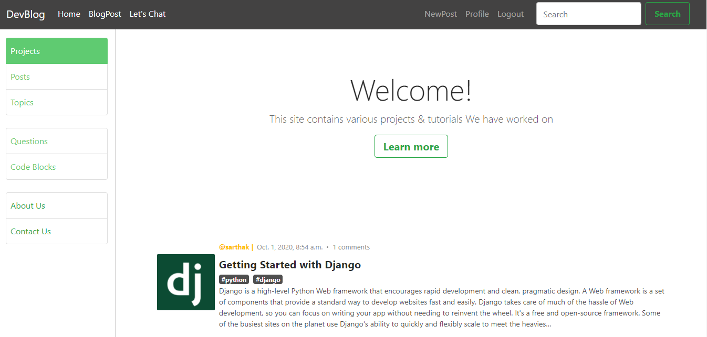
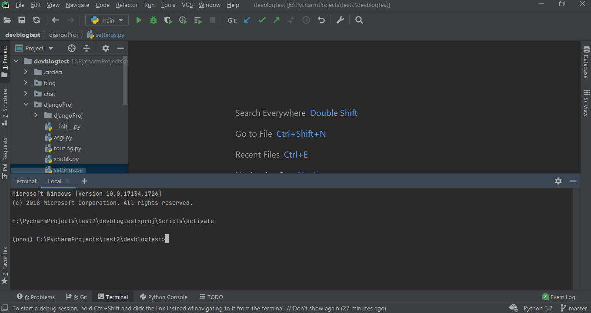
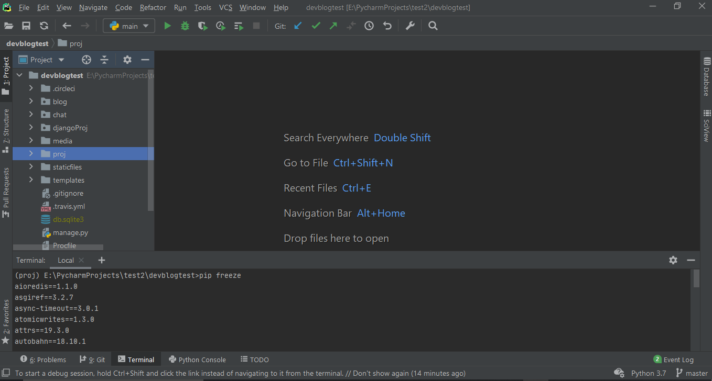
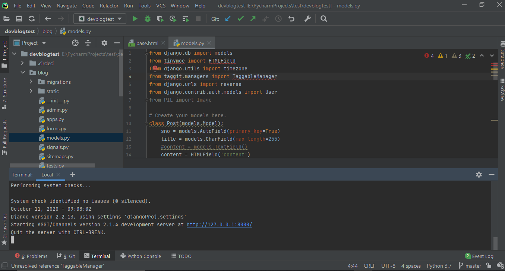

#Blogging Website using Django Framework



### Clone the Repo
```
git clone https://github.com/100sarthak100/devblogtest.git
```
## For Windows Machine

### Make a virtual environment 
```
virtualenv env
env\Scripts\activate // to activate the env
```



### Install the libraries 
```
pip install rcssmin --install-option="--without-c-extensions"
pip install --upgrade -r requirements.txt
```
### Check if everything is installed using this -
```
pip freeze
```

## For Linux Machine

### Make a virtual environment (For Linux)
```
virtualenv env
source env/bin/activate // to activate the env
```
### Now in the Linux terminal do this -
```
sudo apt install libpq-dev python3-dev
```
### Install the libraries (For Linux), inside your IDE terminal with virtualenv activated
```
pip install --upgrade -r requirements.txt
```
### Check if everything is installed using this -
```
pip freeze
```


#### If you got any error installing the libraries, do them individually, and then comment them out from requirements.txt file.


### Now got to djangoProj folder, and inside that go to settings.py file.
- comment out these lines (use CTRL F to search the text) -
```
SECRET_KEY = os.environ.get('SECRET_KEY')
DEBUG = (os.environ.get('DEBUG_VALUE') == 'True')
SECURE_PROXY_SSL_HEADER = ('HTTP_X_FORWARDED_PROTO', 'https')
SECURE_SSL_REDIRECT = True
CSRF_COOKIE_SECURE = True
SESSION_COOKIE_SECURE = True
S3_URL = 'https://' + AWS_STORAGE_BUCKET_NAME + '.s3.us-west-2.amazonaws.com/'
MEDIA_URL = S3_URL
```
-  Un-comment out these lines (use CTRL F to search the text) -
```
SECRET_KEY = '0v4%a84s7b%9iupsri-eg=l0$wxe_)gyifcns%1jg=5wixm+o9'
DEBUG = False
MEDIA_URL = '/media/'
```
- Now make `DEBUG = True`

### Now in the terminal type these commands (make sure virtualenv is activated) -
```
python manage.py makemigrations
python manage.py migrate
python manage.py createsuperuser -> provide username and password
```
### Now for the final step to start the server do this -
`
python manage.py runserver
`


### open this `http://127.0.0.1:8000/` in the incognito window.
